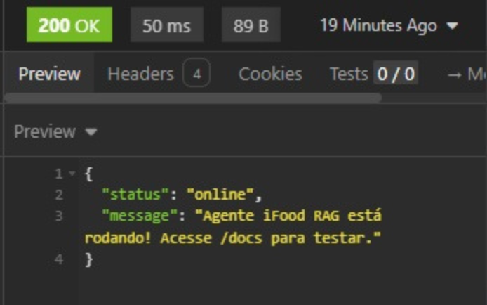
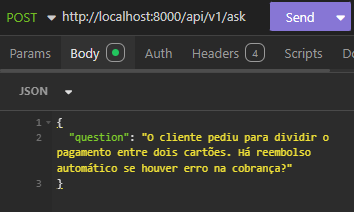
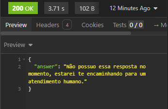
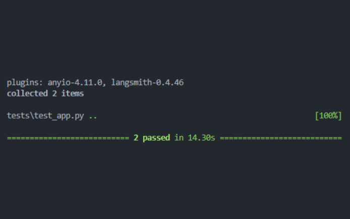

# Agente de IA para Reembolsos - Desafio iFood

Uma solução **High Code** desenvolvida para o desafio técnico de estágio do iFood. Este projeto implementa um Agente de IA generativa capaz de responder dúvidas de parceiros e clientes sobre **Reembolsos e Cancelamentos**, utilizando uma arquitetura RAG robusta, escalável e observável.


## Arquitetura e Fluxo de Dados

O sistema utiliza o padrão RAG para garantir que as respostas sejam baseadas estritamente na base de conhecimento oficial (`base_conhecimento_ifood_genai-exemplo.csv`), reduzindo alucinações.

1.  **Ingestão:** os dados são carregados, enriquecidos com metadados (Categoria/Fonte) e transformados em vetores (Embeddings) via **Google Text-Embedding-004**.
2.  **Armazenamento:** os vetores são persistidos no **ChromaDB** para busca semântica de alta performance.
3.  **Recuperação (Retrieval):** quando o usuário faz uma pergunta, o sistema busca os trechos mais relevantes da política interna.
4.  **Geração:** o **Google Gemini** recebe a pergunta + o contexto recuperado e gera a resposta final seguindo regras estritas e *fallback*.


## Diferenciais da Solução

Como um bônus, a solução foi desenhada como uma API pronta para produção:

* **Estrutura Modular (MVC):** separação clara entre Lógica da API (`app/`), Scripts de Manutenção (`scripts/`) e Dados (`data/`).
* **Fallback Inteligente:** implementação de regras de negócio rígidas. Se a resposta não estiver na base, o agente responde: *"Não possuo essa resposta no momento, estarei te encaminhando para um atendimento humano"*.
* **Observabilidade:** sistema de **Logging** centralizado (`logger.py`) para rastreamento de requisições e erros em tempo real.
* **Testes Automatizados:** módulo de testes com `pytest` e `httpx` garantindo a integridade dos endpoints e da lógica de fallback.

#### Exemplos de Logs:

```
2025-11-24 16:53:32 | INFO | [API_MAIN] -> Recebida nova pergunta: 'O restaurante cancelou por falta de ingredientes. O reembolso é automático?'
2025-11-24 16:53:34 | INFO | [API_MAIN] -> Carregando base vetorial...
2025-11-24 16:53:37 | INFO | [API_MAIN] -> Resposta gerada com sucesso.
```

## Stack Tecnológica

| Componente | Tecnologia |
| :--- | :--- | 
| **Linguagem** | Python 3.12 |
| **API Framework** | FastAPI |
| **LLM** | Gemini 1.5 Flash / 2.5 Flash | 
| **Vector Store** | ChromaDB | 
| **Orquestração** | LangChain (LCEL) | 


## Instalação e Execução

#### 1. Pré-requisitos:

   - Python 3.10 ou superior
   - Uma API Key do [Google AI Studio](https://aistudio.google.com/)

#### 2. Configuração do Ambiente:

Clone o repositório e configure o ambiente virtual:

```
# Clone o projeto
git clone https://github.com/pietro-franca/poc-agente-reembolsos-ifood-high-code.git
cd poc-agente-reembolsos-ifood-high-code

# Crie o ambiente virtual
python -m venv venv

# Ative o ambiente
# Windows:
.\venv\Scripts\activate
# Linux/Mac:
source venv/bin/activate

# Instale as dependências
pip install -r requirements.txt
```

#### 3. Configuração de Variáveis

Crie um arquivo `.env` na raíz do projeto e adicione sua chave de API:

```
GOOGLE_API_KEY=sua_chave_secreta_aqui
```

#### 4. Ingestão de Dados

Antes de rodar a API, é necessário processar o CSV e criar o índice vetorial. Execute o script a partir da raíz:

```
python -m scripts.ingest
```

Saída esperada: "Sucesso! 20 regras de negócio indexadas"


## Como usar

### Iniciando a API

Suba o servidor localmente com o Uvicorn:

```
uvicorn app.main:app --reload
```

A API estará disponível na porta 8000: `http://localhost:8000`



Use a rota `http://localhost:8000/` para testar a conexão

### Documentação Interativa

Acesse `http://localhost:8000/docs` para testar os endpoints visualmente direto no navegador


### Exemplos de Requisição (Curl)

Aqui, você também pode usar outras ferramentas como Postman ou Insomnia, por exemplo:



Exemplo de pergunta, em formato json `{ "question": "..." }`



Exemplo de resposta, em formato json `{ "answer": "..." }`

#### Pergunta Válida

```
curl -X POST "http://localhost:8000/api/v1/ask" \
     -H "Content-Type: application/json" \
     -d '{"question": "Qual o prazo para estorno no cartão de crédito?"}'
```

#### Teste de Fallback

```
curl -X POST "http://localhost:8000/api/v1/ask" \
     -H "Content-Type: application/json" \
     -d '{"question": "O cliente pediu para dividir o pagamento entre dois cartões. Há reembolso automático se houver erro na cobrança?"}'
```

Resposta esperada: "Não possuo essa resposta no momento, estarei te encaminhando para um atendimento humano"


## Testes 

O projeto também inclui testes automatizados para garantir que a API responde corretamente e que o fallback está funcionando corretamente. Para rodar os testes, use:

```
python -m pytest
```

Resposta esperada no terminal:

